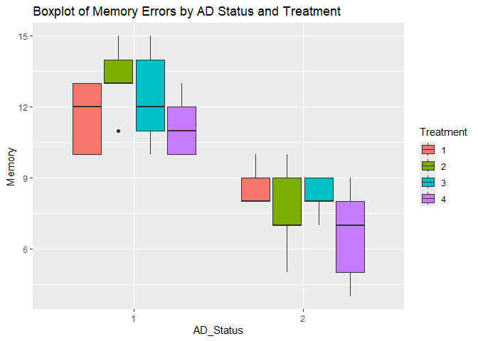

SA 2 - Comparing Memory Day Errors on Drug Treatments and AD Status
================
Cuerdo, Naomi Hannah A.
2024-12-09

# Introduction

This report examines the effects of Alzhimer’s Disease (AD) status and
drug treatment on training errors. Training errors were measured as the
number of errors committed during a training session, recorded on a
continuous scale. The independent variables included:

*- AD Status*: Categorized as “With AD” (coded as 1) and “Without AD”
(coded as 2)

*- Treatment*: Drug treatment type categorized into four groups: “A”
(coded as 1), “B” (coded as 2), “C” (coded as 3), and “D” (coded as 4)

Furthermore, this analysis explores the interaction between AD status
and treatment type to understand their combined influence on training
performance.

# Method

## Participants

The dataset consisted of a sample of experimental subjects assigned to
two AD status groups and four treatment groups. The dependent variable
was *memory day errors*, measured as a continuous variable representing
task performance.

## Procedure

Memory Day errors were analyzed using a two-way (2B) ANOVA with two
between-subject factors: AD status and treatment. This statistical
method was chosen to assess the main effects of AD status and treatment,
as well as their interaction effect, on training errors.

Below are the assumptions:

Below are the assumptions: *Assumption 1.* The dependent variable
(memory day errors) is measured at the continuous level. *Assumption 2.*
The two independent variables (AD Status and Treatment) consists of two
or more categorical independent groups. The AD Status is the dichotomous
variable, whereas the Treatment is the polytomous variable. *Assumption
3.* The independence of observations among each group of the independent
variable or between the group themselves is observed. *Assumption 4.*
There should be no significant outliers in any cell of the design.
*Assumption 5.* The distribution of the dependent variable should be
approximately normally distributed in every cell of the design.
*Assumption 6.* The variance of the dependent variable should be equal
in every cell of the design.

## Hypothesis

**1.Main Effect on AD Status**

Null Hypothesis (H₀): There is no difference in memory day scores
between individuals with AD and those without AD.

Alternative Hypothesis (H₁): There is a significant difference in memory
day scores between individuals with AD and those without AD.

**2.Main Effect on Treatment**

Null Hypothesis (H₀): There is no difference in memory day across
different treatment groups.

Alternative Hypothesis (H₁): There is a significant difference in memory
day between at least two treatment groups.

**3.Interaction Effect between AD Status and Treatment**

Null Hypothesis (H₀): There is no interaction between AD status and
treatment type in their effect on memory day scores. The effect of
treatment is the same for individuals with and without AD.

Alternative Hypothesis (H₁): There is a significant main interaction
effect on AD Status and treatment type on memory day scores.

# Descriptive Analysis

``` r
head(data)
```

    ##   AD_Status Treatment Training Memory
    ## 1         1         1       12     10
    ## 2         1         1       15     12
    ## 3         1         1       13     13
    ## 4         1         1       12     10
    ## 5         1         1       14     13
    ## 6         1         2       15     13

``` r
summary(data)
```

    ##  AD_Status Treatment    Training         Memory      
    ##  1:20      1:10      Min.   :12.00   Min.   : 4.000  
    ##  2:20      2:10      1st Qu.:13.75   1st Qu.: 8.000  
    ##            3:10      Median :14.00   Median :10.000  
    ##            4:10      Mean   :14.72   Mean   : 9.925  
    ##                      3rd Qu.:16.00   3rd Qu.:12.000  
    ##                      Max.   :18.00   Max.   :15.000

``` r
standard_dev <- sd(data$Memory, na.rm = TRUE)
print(sprintf("St dev: %.2f", standard_dev))
```

    ## [1] "St dev: 2.74"

The dataset included 20 participants identified as “With AD” (coded
as 1) and 20 as “Without AD” (coded as 2). There were 10 participants in
each of the 4 treatment groups (1, 2, 3, 4)

The dependent variable, *Training Errors*, was measured on a continuous
scale, with values ranging from 12 to 18 errors. The *mean* number of
errors was ***M=9.925***, with a ***standard deviation (SD) = 2.74.***

***Thus, Assumptions 1 and 2 was achieved.***

``` r
aggregate(Memory ~ AD_Status + Treatment, data = data, FUN = base::mean)
```

    ##   AD_Status Treatment Memory
    ## 1         1         1   11.6
    ## 2         2         1    8.6
    ## 3         1         2   13.2
    ## 4         2         2    7.6
    ## 5         1         3   12.4
    ## 6         2         3    8.2
    ## 7         1         4   11.2
    ## 8         2         4    6.6

The table above indicates that *Memory Scores* vary across combinations
of AD_Status and Treatment. Individuals with *AD (AD_Status = 1)* and
*Treatment 2* reported the highest mean training scores *(M = 13.2)*,
while individuals without AD *(AD_Status = 2)* in Treatment 4 reported
the lowest mean scores *(M = 6.6)*.

Therefore, there is no overlap or duplication in data points within
groups.

***Assumption 3 (independence of observations) was achieved.***

``` r
ggplot(data, aes(x = AD_Status, y = Memory, fill = Treatment)) +
  geom_boxplot() +
  labs(title = "Boxplot of Memory Errors by AD Status and Treatment")
```

<!-- -->
Given that there is one outlier around treatment 2, we shall check if
this significantly affects the dataset.

``` r
Q1 <- quantile(data$Memory, 0.25, na.rm = TRUE)  
Q3 <- quantile(data$Memory, 0.75, na.rm = TRUE)  
IQR_value <- Q3 - Q1                            

# Define lower and upper bounds
lower_bound <- Q1 - 1.5 * IQR_value
upper_bound <- Q3 + 1.5 * IQR_value

# Identify potential outliers
outliers <- data %>%
  filter(Memory < lower_bound | Memory > upper_bound)

# Display results
cat("Lower Bound:", lower_bound, "\n")
```

    ## Lower Bound: 2

``` r
cat("Upper Bound:", upper_bound, "\n")
```

    ## Upper Bound: 18

``` r
print(outliers)
```

    ## [1] AD_Status Treatment Training  Memory   
    ## <0 rows> (or 0-length row.names)

Given that from the IQR, it showed that there are zero rows, this
indicates that the outliers from the graph does not significantly affect
the results.

***assumption 4 was achieved***

``` r
model <- aov(Memory ~ AD_Status + Treatment, data = data,)
shapiro.test(residuals(model))
```

    ## 
    ##  Shapiro-Wilk normality test
    ## 
    ## data:  residuals(model)
    ## W = 0.97213, p-value = 0.4193

``` r
shapiro_results_memory <- data %>%
  group_by(AD_Status, Treatment) %>%
  summarise(
    shapiro_stat = shapiro.test(Memory)$statistic,
    p_value = shapiro.test(Memory)$p.value
  )
```

    ## `summarise()` has grouped output by 'AD_Status'. You can override using the
    ## `.groups` argument.

``` r
print(shapiro_results_memory)
```

    ## # A tibble: 8 × 4
    ## # Groups:   AD_Status [2]
    ##   AD_Status Treatment shapiro_stat p_value
    ##   <fct>     <fct>            <dbl>   <dbl>
    ## 1 1         1                0.803  0.0857
    ## 2 1         2                0.956  0.777 
    ## 3 1         3                0.952  0.754 
    ## 4 1         4                0.902  0.421 
    ## 5 2         1                0.771  0.0460
    ## 6 2         2                0.953  0.758 
    ## 7 2         3                0.881  0.314 
    ## 8 2         4                0.952  0.754

The Shapiro-Wilk test indicated a deviation from normality in one group
(𝑊=0.77,𝑝= 0.046). However, given that ANOVA is robust to such
violations with moderate-to-large sample sizes, the analysis was
conducted with caution.

***Assumption 5 was achieved with caution***

``` r
leveneTest(Memory ~ AD_Status * Treatment, data = data)
```

    ## Levene's Test for Homogeneity of Variance (center = median)
    ##       Df F value Pr(>F)
    ## group  7  0.8275 0.5722
    ##       32

From the table above, the training scores across the independent
variables show similar levels of variability (***F*** = 0.83, ***p*** \>
.05). This means that the variances (or spread) of the training scores
are *equal across the groups*. Because the p-value is greater than the
significance level of 0.05, we *fail* to reject the null hypothesis that
the variances are equal.

***Assumption 6 was achieved***

# Inferential Analysis

## Two-Way (2B) ANOVA

Now that all assumptions were checked, we can now proceed with the ANOVA
Analysis.

``` r
anova_memory <- aov(Memory ~ AD_Status * Treatment, data = data)
summary(anova_memory)
```

    ##                     Df Sum Sq Mean Sq F value   Pr(>F)    
    ## AD_Status            1 189.22  189.22  75.313 6.45e-10 ***
    ## Treatment            3  14.48    4.83   1.920    0.146    
    ## AD_Status:Treatment  3   8.67    2.89   1.151    0.344    
    ## Residuals           32  80.40    2.51                     
    ## ---
    ## Signif. codes:  0 '***' 0.001 '**' 0.01 '*' 0.05 '.' 0.1 ' ' 1

From the table, it seems that there are no significant effects in Memory
Errors and AD Status F(1,32)=75.31,p\<0.001). Since there are no
significant effects on Memory Day Errors for these factors, conducting
post hoc tests would not provide meaningful results.

# APA Report

A two-way ANOVA was conducted to examine the effects of *AD Status* and
*Treatment* on *memory errors*. Assumptions of normality and homogenity
of variance were evaluated. The Shapiro-Wilk test for normality showed
mixed results: for some groups, the residuals were normally distributed
*(e.g., Treatment 1, AD Status 1, p = 0.08).* However, Levene’s test for
homogeneity of variance was non-significant, indicating that the
variances were equal across the groups (F(7, 32) = 2.21, p = 0.07),
suggesting that the assumption of homogeneity of variances was met.

Results revealed that there is a statistically significant main effect
of AD Status on memory errors, *F(1, 32) = 75.31, p \< 0.001, η² =
0.70*, indicating that individuals with Alzheimer’s Disease (AD) made
significantly more memory errors compared to those without AD.

However, there was no significant main effect of Treatment on memory
errors, *F(3, 32) = 1.92, p = 0.146,* suggesting that the different
treatment groups did not significantly affect memory errors.
Additionally, the interaction between AD Status and Treatment was not
significant, *F(3, 32) = 1.15, p = 0.344,* indicating that the effect of
treatment on memory errors did not differ based on AD status.
