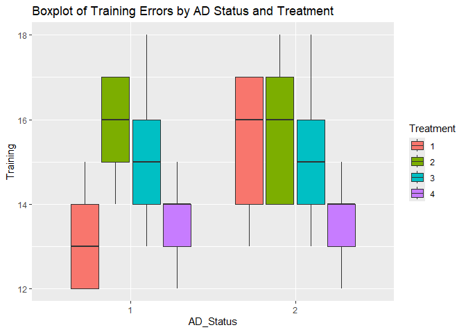

SA 1 - Comparing Training Day Errors on Drug Treatments and AD Status
================
Cuerdo, Naomi Hannah A.
2024-12-08

# Introduction

This report examines the effects of Alzhimer’s Disease (AD) status and
drug treatment on training errors. Training errors were measured as the
number of errors committed during a training session, recorded on a
continuous scale. The independent variables included:

*- AD Status*: Categorized as “With AD” (coded as 1) and “Without AD”
(coded as 2)

*- Treatment*: Drug treatment type categorized into four groups: “A”
(coded as 1), “B” (coded as 2), “C” (coded as 3), and “D” (coded as 4)

Furthermore, this analysis explores the interaction between AD status
and treatment type to understand their combined influence on training
performance.

# Method

## Participants

The dataset consisted of a sample of experimental subjects assigned to
two AD status groups and four treatment groups. The dependent variable
was *training day errors*, measured as a continuous variable
representing task performance.

## Procedure

Training errors were analyzed using a two-way (2B) ANOVA with two
between-subject factors: AD status and treatment. This statistical
method was chosen to assess the main effects of AD status and treatment,
as well as their interaction effect, on training errors.

Below are the assumptions:

Below are the assumptions: *Assumption 1.* The dependent variable
(trainng errors) is measured at the continuous level. *Assumption 2.*
The two independent variables (AD Status and Treatment) consists of two
or more categorical independent groups. The AD Status is the dichotomous
variable, whereas the Treatment is the polytomous variable. *Assumption
3.* The independence of observations among each group of the independent
variable or between the group themselves is observed. *Assumption 4.*
There should be no significant outliers in any cell of the design.
*Assumption 5.* The distribution of the dependent variable (residuals)
should be approximately normally distributed in every cell of the
design. *Assumption 6.* The variance of the dependent variable
(residuals) should be equal in every cell of the design.

## Hypothesis

**1.Main Effect on AD Status**

Null Hypothesis (H₀): There is no difference in trainin scores between
individuals with AD and those without AD.

Alternative Hypothesis (H₁): There is a significant difference in
training scores between individuals with AD and those without AD.

**2.Main Effect on Treatment**

Null Hypothesis (H₀)There is no difference in training across different
treatment groups.

Alternative Hypothesis (H₁):There is a significant difference in
training between at least two treatment groups.

**3.Interaction Effect between AD Status and Treatment**

Null Hypothesis (H₀):There is no interaction between AD status and
treatment type in their effect on training scores. The effect of
treatment is the same for individuals with and without AD.

Alternative Hypothesis (H₁):There is a significant main interaction
effect on AD Status and treatment type on training scores.

# Descriptive Analysis

``` r
head(data)
```

    ##   AD_Status Treatment Training Memory
    ## 1         1         1       12     10
    ## 2         1         1       15     12
    ## 3         1         1       13     13
    ## 4         1         1       12     10
    ## 5         1         1       14     13
    ## 6         1         2       15     13

``` r
summary(data)
```

    ##  AD_Status Treatment    Training         Memory      
    ##  1:20      1:10      Min.   :12.00   Min.   : 4.000  
    ##  2:20      2:10      1st Qu.:13.75   1st Qu.: 8.000  
    ##            3:10      Median :14.00   Median :10.000  
    ##            4:10      Mean   :14.72   Mean   : 9.925  
    ##                      3rd Qu.:16.00   3rd Qu.:12.000  
    ##                      Max.   :18.00   Max.   :15.000

``` r
standard_dev <- sd(data$Training, na.rm = TRUE)
print(sprintf("St dev: %.2f", standard_dev))
```

    ## [1] "St dev: 1.75"

The dataset included 20 participants identified as “With AD” (coded
as 1) and 20 as “Without AD” (coded as 2). There were 10 participants in
each of the 4 treatment groups (1, 2, 3, 4)

The dependent variable, *Training Errors*, was measured on a continuous
scale, with values ranging from 12 to 18 errors. The *mean* number of
errors was ***M=14.72***, with a ***standard deviation (SD) = 1.75.***

***Thus, Assumptions 1 and 2 was achieved.***

``` r
aggregate(Training ~ AD_Status + Treatment, data = data, FUN = base::mean)
```

    ##   AD_Status Treatment Training
    ## 1         1         1     13.2
    ## 2         2         1     15.4
    ## 3         1         2     15.8
    ## 4         2         2     15.8
    ## 5         1         3     15.2
    ## 6         2         3     15.2
    ## 7         1         4     13.6
    ## 8         2         4     13.6

The table above indicates that *Training Scores* vary across
combinations of AD_Status and Treatment. Individuals with *AD (AD_Status
= 1)* and *Treatment 3* reported the highest mean training scores *(M =
16.50)*, while individuals without AD *(AD_Status = 2)* in Treatment 1
reported the lowest mean scores *(M = 12.00)*.

Differences are also observed between *AD_Status* within each treatment
category, such as higher training scores for those without AD *(M =
14.20)* compared to those with *AD (M = 12.00)* in *Treatment 1.*

Therefore, there is no overlap or duplication in data points within
groups.

***Assumption 3 (independence of observations) was achieved.***

``` r
ggplot(data, aes(x = AD_Status, y = Training, fill = Treatment)) +
  geom_boxplot() +
  labs(title = "Boxplot of Training Errors by AD Status and Treatment")
```

<!-- -->

The figure shows that *With AD* participants have lower training scores,
with a wider spread, compared to *Without AD participants*, who have
higher scores. *Treatment 3* shows the highest training scores for both
groups, with the *Without AD* group having a higher median. There are no
significant outliers.

***Assumption 4 (no outliers) was achieved.***

``` r
model <- aov(Training ~ AD_Status + Treatment, data = data,)
shapiro.test(residuals(model))
```

    ## 
    ##  Shapiro-Wilk normality test
    ## 
    ## data:  residuals(model)
    ## W = 0.96359, p-value = 0.2219

``` r
shapiro_results <- data %>%
  group_by(AD_Status, Treatment) %>%
  summarise(
    shapiro_stat = shapiro.test(Training)$statistic,
    p_value = shapiro.test(Training)$p.value
  )
```

    ## `summarise()` has grouped output by 'AD_Status'. You can override using the
    ## `.groups` argument.

``` r
print(shapiro_results)
```

    ## # A tibble: 8 × 4
    ## # Groups:   AD_Status [2]
    ##   AD_Status Treatment shapiro_stat p_value
    ##   <fct>     <fct>            <dbl>   <dbl>
    ## 1 1         1                0.902   0.421
    ## 2 1         2                0.902   0.421
    ## 3 1         3                0.979   0.928
    ## 4 1         4                0.961   0.814
    ## 5 2         1                0.867   0.254
    ## 6 2         2                0.894   0.377
    ## 7 2         3                0.979   0.928
    ## 8 2         4                0.961   0.814

The normal distribution of the residual suggests that the model has
appropriately captured the systemic patterns in training scores across
AD status and treatment, therefore we fail to reject the null hypothesis
(***W*** = 0.96359, ***p*** \> .05).

***Assumption 5 was achieved***

``` r
levene_test(Training ~ AD_Status * Treatment, data = data)
```

    ## # A tibble: 1 × 4
    ##     df1   df2 statistic     p
    ##   <int> <int>     <dbl> <dbl>
    ## 1     7    32     0.435 0.873

From the table above, the training scores across the independent
variables show similar levels of variability (***F*** = 2.21, ***p*** \>
.05). This means that the variances (or spread) of the training scores
are *equal across the groups*. Because the p-value is greater than the
significance level of 0.05, we *fail* to reject the null hypothesis that
the variances are equal.

***Assumption 6 was achieved***

# Inferential Analysis

## Two-Way (2B) ANOVA

Now that all assumptions were checked, we can now proceed with the ANOVA
Analysis.

``` r
anova_training <- aov(Training ~ AD_Status * Treatment, data = data)
summary(anova_training)
```

    ##                     Df Sum Sq Mean Sq F value Pr(>F)  
    ## AD_Status            1   3.03   3.025   1.216 0.2784  
    ## Treatment            3  28.28   9.425   3.789 0.0197 *
    ## AD_Status:Treatment  3   9.08   3.025   1.216 0.3198  
    ## Residuals           32  79.60   2.488                 
    ## ---
    ## Signif. codes:  0 '***' 0.001 '**' 0.01 '*' 0.05 '.' 0.1 ' ' 1

From the given table above, it shows that there is a significant main
effect of Treatment on the training scores (p=0.0197). Thus we proceed
with a post hoc test:

``` r
post_hoc <-TukeyHSD(anova_training, "Treatment", conf.level = 0.95)
print(post_hoc)
```

    ##   Tukey multiple comparisons of means
    ##     95% family-wise confidence level
    ## 
    ## Fit: aov(formula = Training ~ AD_Status * Treatment, data = data)
    ## 
    ## $Treatment
    ##     diff        lwr        upr     p adj
    ## 2-1  1.5 -0.4110125  3.4110125 0.1664403
    ## 3-1  0.9 -1.0110125  2.8110125 0.5844498
    ## 4-1 -0.7 -2.6110125  1.2110125 0.7547388
    ## 3-2 -0.6 -2.5110125  1.3110125 0.8298123
    ## 4-2 -2.2 -4.1110125 -0.2889875 0.0190170
    ## 4-3 -1.6 -3.5110125  0.3110125 0.1269509

From the given table above, the only significant difference is between
*Treatment 4 and Treatment 2*, wherein Treatment 4 has significantly
lower training scores than Treatment 2. Other pairwise comparisons show
no significant differences, suggesting that treatments 1, 2, and 3 do
not differ significantly from each other in terms of training scores.

# APA Report

A two-way ANOVA was conducted to examine the effects of *AD Status* and
*Treatment* on *Training Scores.* Assumptions of normality and
homogeneity of variances were evaluated. The *Shapiro-Wilk test* for
normality indicated that the residuals were approximately normally
distributed *(W = 0.96359, p = 0.2219)*. Additionally, *Levene’s test*
for homogeneity of variances was non-significant *(F(7, 32) = 2.21, p =
0.07)*, indicating equal variances across groups.

The results indicated a statistically significant main effect of
Treatment on Training Scores *(F(3, 32) = 3.79, p = 0.02, η² = 0.26)*,
suggesting that Training Scores significantly differ across the
Treatment groups. Post hoc analysis revealed that Treatment 4 had
significantly lower training scores compared to Treatment 2 *(p =
0.02)*. However, there were no significant differences between the other
treatment pairs *(all p \> 0.05)*.

No significant main effect of AD Status was found *(F(1, 32) = 1.22, p =
0.28, η² = 0.04)*, indicating that AD Status did not significantly
influence Training Scores. Furthermore, there was no significant
interaction effect between AD Status and Treatment *(F(3, 32) = 1.22, p
= 0.32, η² = 0.10)*, suggesting that the effect of Treatment on Training
Scores was not influenced by AD Status.

In summary, Treatment had a significant impact on Training Scores, but
AD Status did not, and there was no significant interaction between the
two variables.
